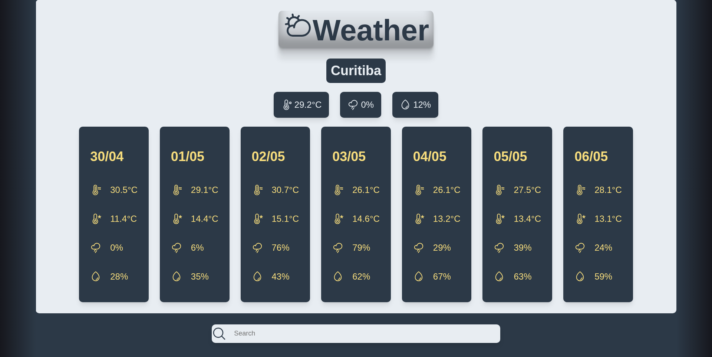

<table>
  <tr>
    <td></td>
    <td><h1>Weather App</h1></td>
  </tr>
</table>

*This project was based on this [idea](https://roadmap.sh/projects/weather-app) and features the use of open-meteo weather and geolocation APIs, you can find more about at:*

**[Open Meteo](https://open-meteo.com/)**



### Quick start:

Run:

```bash
npm install
```

Then:

```bash
npm run dev
```
